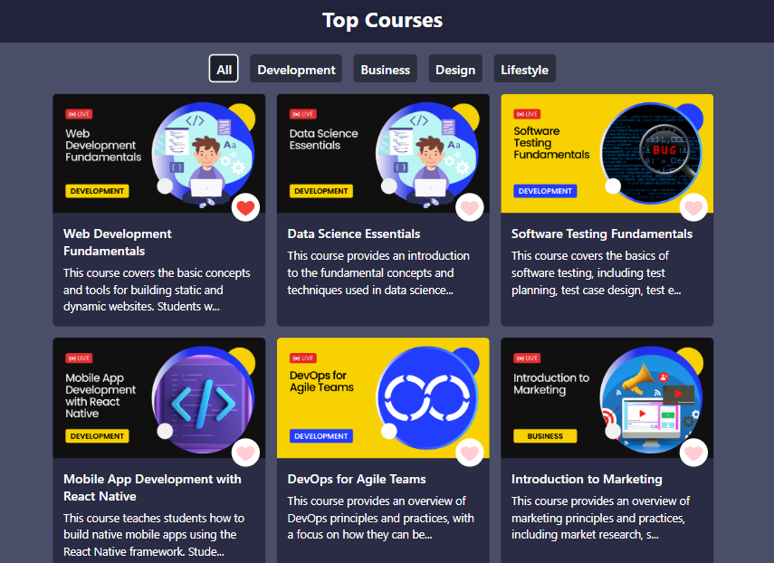

<!DOCTYPE html>
<html>
<head>
</head>
<body>
  <h1>Top Courses</h1>

  
This is a React-based web application that displays a list of top courses, allowing users to filter them by different fields using a navigation bar. The project utilizes Tailwind CSS for styling, resulting in a clean and modern user interface.

  <h2>Features</h2>
  <ul>
    <li><strong>Course Filtering:</strong> 
      <ul>
        <li>A navigation bar with buttons for different fields (e.g., "Web Development", "Data Science", "Design").</li>
        <li>Clicking a field button filters the displayed courses to show only those related to the selected field.</li>
      </ul>
    </li>
    <li><strong>Course Information:</strong> 
      <ul>
        <li>Displays key information for each course, such as course title, instructor, and a brief description.</li>
      </ul>
    </li>
    <li><strong>User Interface:</strong> 
      <ul>
        <li>Designed with a focus on a visually appealing and user-friendly experience using Tailwind CSS.</li>
      </ul>
    </li>
    <li><strong>React Implementation:</strong> 
      <ul>
        <li>Demonstrates core React concepts like components, state management, and JSX.</li>
      </ul>
    </li>
  </ul>

  <h2>Technologies Used</h2>
  <ul>
    <li>React: The JavaScript library for building user interfaces.</li>
    <li>Tailwind CSS: A utility-first CSS framework for rapid and efficient styling.</li>
  </ul>

  <h2>Getting Started</h2>
  <ol>
    <li><strong>Clone the repository:</strong>
      <pre><code>git clone https://github.com/DevanshRaghuwanshi/top-course.git</code></pre>
    </li>
    <li><strong>Install dependencies:</strong>
      <pre><code>npm install</code></pre>
    </li>
    <li><strong>Start the development server:</strong>
      <pre><code>npm run start</code></pre>
    </li>
  </ol>

  <h2>Screenshot</h2>
   
  

  
This project provides a basic example of building a React application with filtering functionality and a visually appealing UI.

</body>
</html>
